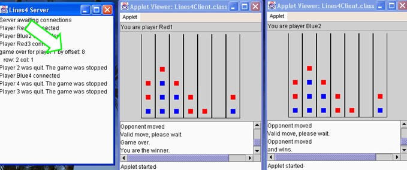

# Weather

## השרת

מומש כ-applet עם GUI מינימלי.

לאחר בחירת אחת מ-3 ערי הבירה (מדגם מייצג כמובן) ב-ComboBox יופיע inputDlg.

בוצע טיפול בהקשת OK או CANCEL.

הכנסת 0 תנטרל את טיפול השרת בלקוחות (ערך שרירותי – תאורטית הטמפרטורה כמובן אפשרית).

## הלקוח

מומש כ-App.

הרצה משורת הפקודה ע"י WeatherClient localhost 1800 tel-aviv לדוגמא.

אם השרת למטה יודפס check server,
אם ה-host לא זוהה => host not found.

# Lines4

השלד מתבסס על דוגמת ticTacToe מספר הלימוד. מייד השינויים בקצרה.

## השרת

final COUPLE – מספר משחקים שניתן לשחק עם השרת. 

כל משתנה המשמש לצורכי ניהול משחק בודד הפך להיות מערך עם COUPLE כניסות.

לצרכי יעילות בניתוח סוף משחק נוסף משתנה occupied – מספר המשבצות התפוסות. (עד 6*7).
יש ROWS*COLS איברים במערך המייצג את לוח המשחק.			
						
כאשר בוצע מהלך, מנסים ל"רדת" עם הכלי (מימוש החוק: "העמודות מתמלאות מלמטה כלפי מעלה") – ע"י הוספת COLS. ובדיקה שעדיין אין שם כלי.

מימוש gameOver ע"י או התמלאות הלוח, או חיפוש רצף.

חיפוש רצף ע"י קבלת offset (לדוגמה, 7 יורד שורה, 8 אלכסון ראשי, 1 ימינה) ונקודת התחלת בדיקה (ראו חישוב התנגשות המשך אלכסון מנקודה בה שיחקו עכשיו בקצה הלוח). בודקים אם היו SEQ כלים של השחקן הנוכחי.

קיים עידון מסויים לעומת ה-ticTac בנוגע לטיפול ב-gameOver. על-מנת שגם השחקן שלא שיחק כעת יקבל הודעה שהוא הפסיד. ועל-מנת לסגור את  ה-socket-ים של השחקנים שסיימו.

בהתחברות על שחקן מקבל את צבעו וגם id.

הודעות מוניטור של השרת צומצמו לעזיבת שחקן והנקודה בה נמצא רצף (ולכן אז הסתיים משחק).

כאשר שחקן התנתק סימלוץ מצב של gameOver ע"י occupied=42 הגורם לסגירת ה-socket.

## הלקוח

בדיקת פרמטרי ה-html: מחשב מארח + יציאת התקשורת.

ברוב המקומות התעלמות מ-exceptions, אשר גרמו לתעופה כללית של השרת ואיתו כל שאר השחקנים המחוברים. 

בוצעה הדפסת הודעה server problem.

ציור הלוח שונה, מ-X/O למלבן מלא, וכן טורים ולא משבצות. (עדיין ה-listener עובד לפי משבצות)

