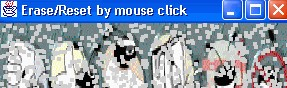
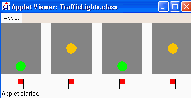

# ErasePic

מחיקת תמונה.

הקשה בעכבר מבצעת toggle בין דרישות reset ל-erase.

כנדרש, מצויירים מלבנים קטנים בצבע הרקע.

התזמון ע"י Timer.

נוסף windowClosing כנדרש.

לא נשמר סט הנקודות שנמחקו, לדעתי הדבר אינו נכון מבחינת דרישות זכרון. במקום זאת, יש הגרלה ללא הפסקה של x'y.

# TrafficLights

הציור מתבצע בעזרת טכניקת דאבל באפר (הסבר קצר במדריך, עמ' 216), למניעת הבחנה בציור עצמו.

ב-html המצורף ניתן ערך 0 ל"צהוב". לשאר הצבעים, ערך ברירת מחדל.

במציאות קיימים 4 שלבים: אדום, אדום+צהוב, ירוק, צהוב וחוזר חלילה. כנדרש, ולמען הפשטות (מערך צבעים חד-מימדי ולא דו) - מומשו 3.

ההנחייה כי אין פנייה ימינה מקלה מאוד על הבדיקה והמימוש. למעשה, רמזור אחד מכתיב את השאר.
